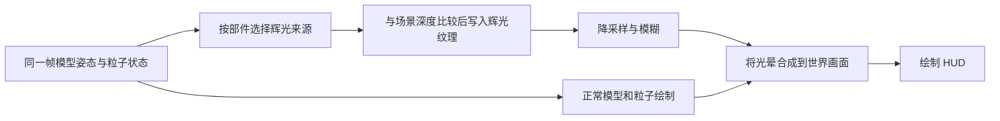

# 指定模型与粒子部件的辉光：可行性与改动范围

状态：设计评估，尚未实现。基于 eyelib `b600cb08`、现有 YesSteveVFX 和本机 Oculus 1.8.0 核对；作者正在开发的后续兼容修复尚未纳入。

## 结论

可以实现。建议由 YesSteveVFX 提供选择性 Bloom：只把指定部件的可见像素作为辉光来源，模糊后叠加到场景。eyelib 继续负责 Bedrock 模型、动画和粒子的几何计算，补充可复用的绘制接口；YSM 继续提供播放控制与资产来源。

无光影与开启 Oculus 都可以纳入支持，但它们需要不同的渲染阶段接入。首个明确验收组合为 Forge 1.20.1 + Oculus 1.8.0 + iterationRP Alpha 0.8.22。不能把“支持 Oculus”直接等同于“任意光影包及其所有后处理效果均无需适配”。

这里的辉光是模型、粒子轮廓外的柔和光晕。材质 emissive 表示表面不随环境光变暗；它不自动等于 Bloom。照亮周围方块、产生投影则是另外的动态光照功能。

## 已核对的现有能力

| 位置 | 当前能力 | 对新需求的影响 |
| --- | --- | --- |
| eyelib `BrRenderStateFactory` / emissive 材质 | 已有自发光材质解析与绘制路径 | 可复用表面亮度语义，但没有发现现成的选择性 Bloom 流程 |
| eyelib `RenderSink`、`SimpleRenderAction`、`RenderParams` | 可传绘制目标、使用动画结果、设置可见部件 | 是模型辉光绘制的基础；还需明确部件标识、无副作用重复绘制和专用材质输出契约 |
| eyelib `BedrockParticleRenderer` | 计算粒子顶点，但当前公共入口直接获取全局 BufferSource，底层顶点绘制方法为 private | 应开放目标缓冲/绘制回调，复用其朝向、序列帧、UV、颜色和 alpha 计算 |
| eyelib `ParticleRenderManager` | 可通过 renderer 回调只读遍历现有粒子 | 不必再建一套粒子模拟；需公开稳定入口与实例归属，避免依赖 adapter 单例 |
| VFX `EffectDefinition` / `LocalVfxAssetSource` | 目前只接受 id、duration_ticks、client_entity 等固定字段 | 新的 bloom 配置需解析器和校验一起扩展，不能现在直接往 JSON 填字段 |
| VFX `VfxAssetSource` / `EffectAssetBundle` | 已隔离文件来源，资源以相对路径和字节内容交付 | 未来由 YSM 容器提供掩码、配置不需改渲染算法 |
| Oculus 1.8.0 `IrisApi` | 可查询光影和阴影阶段，未提供通用自定义 Bloom/深度缓冲注入接口 | VFX 需要隔离版本相关的兼容代码，可能通过可选 Mixin 接入内部阶段 |

## 渲染方案

模型和粒子正常绘制一次，辉光来源再绘制一次。第二次只能复用当前状态，不能再次推进动画时间、触发指令帧或生成粒子。按可见像素写入辉光纹理，纹理原有 alpha、粒子生命周期 alpha、遮挡和颜色均须正确参与。

辉光目标使用浮点颜色纹理保存强度，再通过降采样与上采样模糊扩散。默认按半分辨率运行，可提供品质档位。颜色与强度可逐部件编码；若多个部件需要不同扩散半径，应按有限的辉光组分别模糊，不能在合并成一张纹理后仍声称支持每个像素任意不同半径。

### 无光影

在世界绘制得到有效深度之后，使用专用离屏目标绘制辉光来源，再于世界画面完成后、HUD 之前合成。复用/复制正确的场景深度以遮挡墙后的来源；不要在低分辨率颜色附件上直接挂不匹配尺寸的全分辨率深度附件，可在全分辨率生成来源后降采样，或用匹配的深度采样方案。

不对整张屏幕做亮度筛选，避免天空、太阳、其它玩家或其它模组被无意加入 VFX 辉光。

### Oculus 光影

推荐基线仍由 VFX 自己生成与模糊选中部件的辉光，并在 Oculus 的场景后处理结束、HUD 开始之前合成。这样即使光影包没有 Bloom 或玩家关闭其 Bloom，VFX 的光晕仍可存在。

本机 Oculus 的 `finalizeLevelRendering()` 会先退出世界渲染标志，再执行 composite 与 final pass；它是评估合成接点的依据，但实际注入位置要验证手部、其它模组及最终色彩转换的顺序。不能默认 Forge `AFTER_ENTITIES` 或 `AFTER_LEVEL` 就已经位于光影 final pass 之后。

兼容层负责获取正确场景深度与相机矩阵，处理渲染分辨率、TAA 抖动及资源重建。若选择在独立 framebuffer 中绘制 mask，还必须确认 Oculus 判断的目标绑定状态已经同步，普通自定义 shader 不再被其颜色/深度写入保护屏蔽。不能直接在当前世界 pass 中复用未适配的 eyelib GPU shader。

此方案的限制是：额外光晕通常在光影调色/曝光后加入，不自动获得同等的景深、运动模糊、折射、镜头畸变和反射表现。透明玻璃和水面对光晕的衰减也不是一个普通深度测试即可完整解决。基础验收先覆盖不透明遮挡、画面对齐和普通透明混合，复杂后处理与水下情况单独记录支持范围。

iterationRP 包内已经有 `Bloom_FS.glsl`、`BloomCS_SIG.glsl` 等 Bloom 实现。可以额外设计“使用光影包自身 Bloom”的模式以获得更自然的曝光/调色，但效果会依赖具体包的材质识别和 Bloom 设置，不能作为无光影/有光影统一能力的唯一实现。VFX 的独立光晕与光影对正常部件产生的原生 Bloom 可能叠加，需要提供强度控制和模式选择；后合成只能避免 VFX 光晕本身再次进入该帧光影 Bloom，不能自动消除正常部件已有的光晕。

## 修改哪些项目

| 项目 | 建议改动 | 必要程度 |
| --- | --- | --- |
| YesSteveVFX 配置 | 辉光部件选择、颜色、强度、半径、可选贴图掩码、运行时变量与品质设置 | 必需 |
| YesSteveVFX 渲染 | 来源纹理、深度处理、模糊、最终合成及生命周期管理 | 必需 |
| YesSteveVFX 的 eyelib 适配 | 把效果实例、模型部件、粒子发射器与辉光配置关联，复用当前帧状态绘制 | 必需 |
| YesSteveVFX 的 Oculus 适配 | 可选依赖、阶段与缓冲接入、开关光影和分辨率变化处理 | 支持 Oculus 必需 |
| eyelib | 开放模型与粒子的可选绘制目标、来源标识及无副作用重绘契约 | 推荐的稳定实现方式；不需要把 Bloom 算法搬进库 |
| YSM | 继续现有控制和资产交付；配置与掩码作为普通资源携带 | 不需要为基础 Bloom 修改模型渲染 |
| Oculus / 光影包 | 基础方案通过 VFX 兼容模块接入 | 不预设必须修改其源码；深度整合可能需要特定适配 |

若完全不改 eyelib，可以在 VFX 内通过 Mixin 拦截绘制或复制粒子渲染代码实现原型，但会依赖其内部方法、GPU/CPU 分支和更新时序。对持续维护的功能，更建议趁作者正在修兼容时补上小型公开扩展点。

## 给 eyelib 作者的接口需求

1. **模型额外绘制入口**：基于当前帧已求值的动画姿态，按模型组件筛选，输出到调用方的 RenderSink/VertexConsumer；调用方可指定辉光来源材质、颜色、贴图掩码，并选择该 pass 使用 CPU 输出。若要模型内部某个骨骼发光，再增加骨骼/子树筛选。二次绘制不推进动画、不触发关键帧。
2. **粒子额外绘制入口**：遍历已有粒子，并将正常绘制使用的朝向、尺寸、UV/序列帧、颜色和 alpha 计算复用到调用方的目标。不要把全局 BufferSource 固定在唯一入口中；也不要要求 VFX 重新实现整套粒子公式。
3. **稳定归属上下文**：回调中能识别模型组件、发射器实例和所属效果实例，允许携带外部标识。相同 particle definition 可能被不同特效以不同辉光参数同时播放，不能只用全局资源 ID 作开关。效果停止后，尚存活粒子的标签应随其正常生命周期清理。

已有 `RenderSink` 和粒子 renderer 回调可作为基础，不要求重新设计整个 eyelib。新增接口宜是通用“额外渲染 pass / 外部绘制目标”能力，Bloom 的配置、模糊算法和 Oculus 版本适配由 VFX 维护。

## 配置粒度与运行时控制

第一阶段的“部件”定义为一个模型组件或一个粒子发射器。配置使用特效内部稳定名称，而非渲染列表序号；模型骨骼筛选和贴图掩码按需要进一步开放。掩码是独立灰度纹理，不能挪用原贴图透明度，以免破坏模型/粒子的透明效果。

建议参数：enabled、颜色、intensity、radius、可选 mask、是否同时使表面 emissive。默认只让指定部件成为辉光来源；未指定部件仍正常绘制。半径应定义为固定参考分辨率下的屏幕尺寸，避免窗口大小变化导致风格漂移。

运行时强度可以复用 `ctrl.vfx_set` / `EffectBackend.set` 与特效 Molang 变量，例如让强度读取 `variable.vfx_bloom_strength`。这需要 VFX 新的辉光流程读取该变量，当前并非已有可用功能。未来 YSM 通用容器只需交付相同 JSON 和掩码字节，配置不依赖本地绝对路径。

## 推荐实施顺序和验证

1. 先完成作者正在修复的普通模型 Oculus 兼容，避免本体不可见与辉光问题混在一起。
2. 用同一模型和同一粒子分别验证“正常画面 + 可见来源纹理”；先证明能筛选部件、保留动画与 alpha、正确遮挡，且无重复发射/动画推进。
3. 加入无光影 Bloom，确定半径、颜色、强度和品质开销。
4. 接入 Oculus 1.8.0 + iterationRP，验证开关光影、TAA/渲染比例、窗口缩放、重载、切世界、暂停和资源释放。
5. 验证组合特效、同资源不同实例参数、半透明淡出、墙后遮挡、多个辉光半径组；再决定更多光影包与特殊后处理的支持范围。

默认未启用辉光时不分配相关帧缓冲、不开额外绘制。测试应包含大量粒子和多个实例，测量 GPU 时间、显存与 CPU 顶点重绘开销。这里是可行性评估，不将尚未实现的流程当作已验证兼容。

## JunEffect 参考的边界

现有解包资料中：`plugin/source/juneffects/juneffects/skMechanic/aa.java` 通过 `org.inventivetalent.glow.GlowAPI` 给实体设置发光颜色；对应 `na_1.java` 调用 `GlowAPI.setGlowing`，这条是实体描边功能。`skMechanic/Q.java` 的 `textureGlow` 传给 `GermEntityBedrock.setTextureGlowPath`，实现委托给 Germ。客户端 `JunEffect.glowBlock` 则调用方块选择框绘制。

这些线索不能直接证明 JunEffect 自己已实现“任意指定 Bedrock 模型/粒子部件、跨光影环境的 Bloom”。混淆和外部依赖也使得“未找到”不等于“绝对没有”。本方案借鉴效果目标，不依赖尚未确认的 JunEffect 内部实现。

本地代码参考：[EffectDefinition](../src/main/java/com/elfmcys/ysmvfx/asset/EffectDefinition.java)、[LocalVfxAssetSource](../src/main/java/com/elfmcys/ysmvfx/asset/LocalVfxAssetSource.java)、[EyelibBackend](../src/eyelib/java/com/elfmcys/ysmvfx/compat/eyelib/EyelibBackend.java)、[RenderSink](../../eyelib-upstream/src/main/java/io/github/tt432/eyelib/bridge/client/render/RenderSink.java)、[BedrockParticleRenderer](../../eyelib-upstream/src/main/java/io/github/tt432/eyelib/bridge/particle/adapter/BedrockParticleRenderer.java)、[ParticleRenderManager](../../eyelib-upstream/src/main/java/io/github/tt432/eyelib/particle/ParticleRenderManager.java)、[已核实的 Oculus shader 屏蔽机制](EYELIB-OCULUS-MODEL-INVISIBLE.md)。
